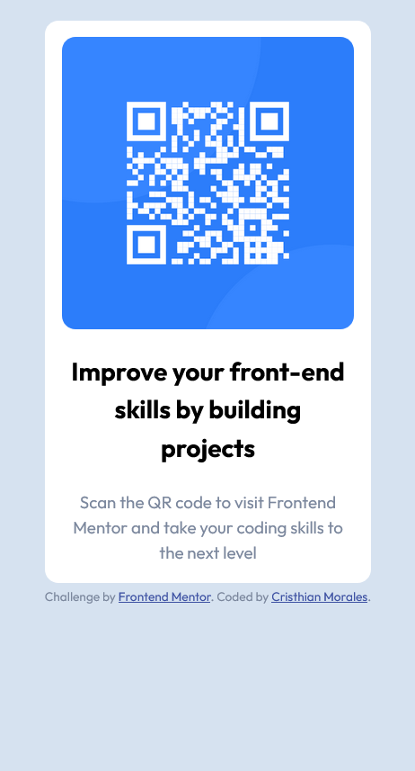
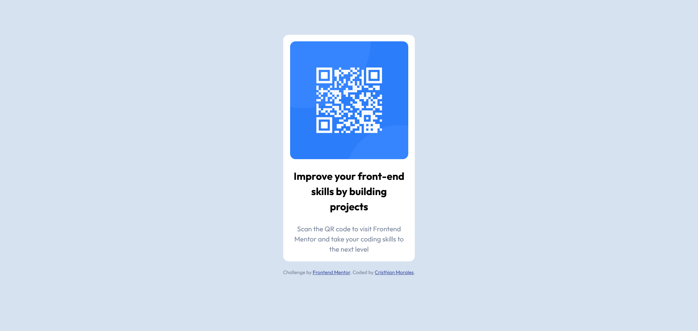

# Frontend Mentor - QR code component solution

This is a solution to the [QR code component challenge on Frontend Mentor](https://www.frontendmentor.io/challenges/qr-code-component-iux_sIO_H). Frontend Mentor challenges help you improve your coding skills by building realistic projects. 

## Table of contents

  - [Overview](#overview)
  - [Screenshot](#screenshot)
  - [Links](#links)
  - [My process](#my-process)
  - [Built with](#built-with)
  - [What I learned](#what-i-learned)
  - [Continued development](#continued-development)
  - [Author](#author)
  - [Acknowledgments](#acknowledgments)

---
## Overview
The goal of this challenge is to design a QR component.  

---
## Screenshot

### Mobile version.
<!--   -->


### Desktop version.


---

## Links

- Live Site URL: [QR-code-component here](https://camoralesh27.github.io/qr-code-component/)

---

## My process
First I began analyzing the design and the blocks that I needed. I selected three blocks, a main block that contain the next two blocks: One for the image, and one for the text. 

```html
<main class="contenedor">
    <div class="cont__img">
      
    </div> 


    <div class="cont__text">
      <h2 class="cont__text1">Improve your front-end skills by building projects</h2>

      <p class="cont__text2">Scan the QR code to visit Frontend Mentor and take your coding skills to the next level</p>
    </div>
  </main>

```
The next step was to give it the style. In the mobile version it was going to be the same block but with the background bigger, so I don't used media queries, just the same code but with different margin. 

---
## Built with

- Semantic HTML5 markup
- CSS custom properties
- Flexbox
- Mobile-first workflow

---

## What I learned
I did strengthen my knowledge about mobile-first workflow. For me, now it's more easy make the mobile version first and then adapt it to the desktop. 
I became with this first challenge more confident about what can I do coding, more confident about my coding skills. 

---

## Continued development

I want to learn more about flexbox and grid, and responsive design. I need to be an expert and learn how to do attractive designs like this one. 

---

## Author

- Frontend Mentor - [@Camoralesh27](https://www.frontendmentor.io/profile/Camoralesh27)

---

## Acknowledgments
Thank you to my God, for the life and every capacity that I have, because God put in me want to code, and give me the tools to learn to code.
Thank you to the teacher Juan de la Torre from UDEMY to teach me HTML and CSS. With that knowledge I did this. 

---


